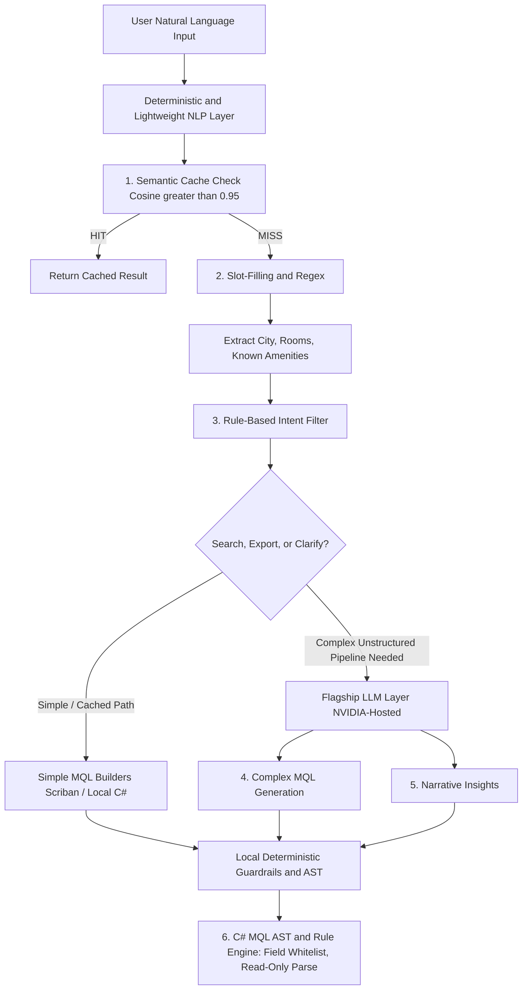
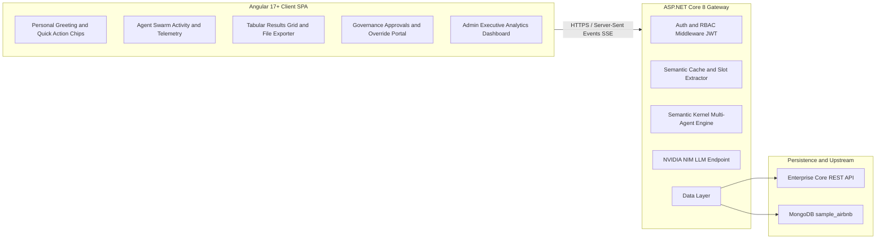
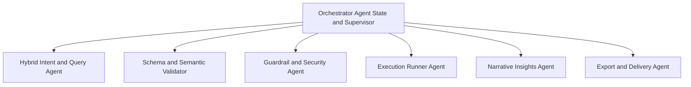
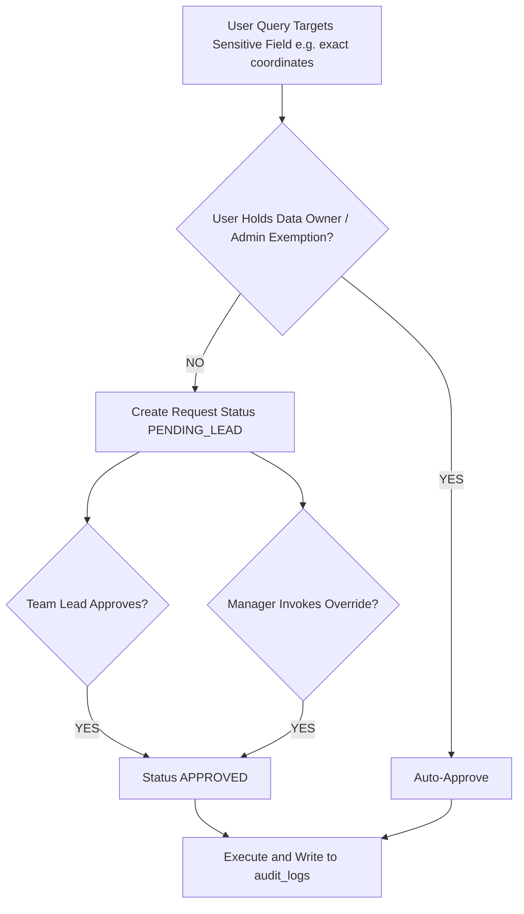

# Business Requirements Document (BRD)

**Project Title:** Enterprise Multi-Agent Natural Language Query & Governance Platform  
**Document Type:** Production Edition  
**Document Version:** 4.1 (C# / .NET Backend Alignment)  
**Date:** September 2026  
**Primary Target Collection:** MongoDB (`sample_airbnb.listingsAndReviews`)  
**Architecture Pattern:** Decoupled Angular 17+ SPA Client + ASP.NET Core 8 Gateway + Semantic Kernel Multi-Agent Orchestrator + Hybrid NLP Engine

### Tech Stack (v4.1)

| Layer | Choice |
| --- | --- |
| Client | Angular 17+ SPA, standalone components, Angular Material / PrimeNG, RxJS `EventSource` |
| Gateway | ASP.NET Core 8 (`net8.0`) Minimal APIs / Web API |
| Auth / RBAC | JWT Bearer (`Microsoft.AspNetCore.Authentication.JwtBearer`) |
| Contracts | FluentValidation + DataAnnotations |
| Agent orchestration | Microsoft Semantic Kernel (process / agent framework) |
| LLM | NVIDIA NIM via Semantic Kernel connector |
| Embeddings / cache | ONNX Runtime + `bge-small` local vectors |
| Slot extraction | `System.Text.RegularExpressions` + gazetteer dictionaries |
| Simple MQL templates | Scriban |
| Guardrails | C# MQL AST walker + rule engine |
| Persistence | MongoDB.Driver against `sample_airbnb` |
| Streaming | HTTPS + Server-Sent Events (`IAsyncEnumerable`) |
| Export | ClosedXML / CsvHelper in-memory; MailKit SMTP; QuestPDF for PDF |

#### Stack substitution from v4.0

| v4.0 (Python) | v4.1 (C# / .NET) |
| --- | --- |
| FastAPI (Python 3.10+) | ASP.NET Core 8 |
| Pydantic | FluentValidation + DataAnnotations |
| LangGraph | Microsoft Semantic Kernel |
| spaCy dictionaries | Regex + gazetteer dictionaries |
| Jinja2 | Scriban |
| Python AST | C# MQL AST walker |
| sentence-transformers `bge-small` | ONNX Runtime `bge-small` |

---

## Document Control

| Field | Value |
| --- | --- |
| Document ID | BRD-MAS-NLP-GOV-4.1 |
| Status | Production / Architecture Baseline |
| Classification | Internal — Enterprise Architecture |
| Primary Audience | Product, Engineering, Security, Data Governance, Operations |
| Source Collection | `sample_airbnb.listingsAndReviews` |
| Related Collections | `audit_logs`, `access_requests`, `schema_field_registry` |

---

## 1. Executive Summary & Problem Statement

### 1.1 Business Context

Enterprise analysts, product managers, and operations personnel need actionable insights from semi-structured listing records (for example, Airbnb properties). Constructing complex MongoDB aggregation pipelines requires specialized developer and database administrator (DBA) bandwidth. That dependency creates support bottlenecks and delays business decisions.

### 1.2 Solution Vision

The platform provides a conversational AI workspace where business users query listing records using plain English. The architecture employs a Hierarchical Multi-Agent System (MAS) coordinated by an Orchestrator Agent.

The system:

- Enforces dynamic, flag-based security governance
- Provides Team Lead and Managerial Overrides
- Records an immutable MongoDB audit trail
- Optimizes operational costs through a Hybrid NLP Layer that offloads routine parsing from the primary Large Language Model (LLM)

### 1.3 Business Outcomes

| Outcome | Description |
| --- | --- |
| Reduced DBA / developer queue time | Business users self-serve listing analytics without writing MQL |
| Governed data access | Sensitive fields pause execution until lead, manager, or data-owner approval |
| Cost control | Routine NLP work stays on local deterministic engines; LLM is reserved for complex pipelines |
| Traceability | Every execution, exemption, and override is written to append-only `audit_logs` |
| Dual data path | Queries can run against MongoDB or upstream Enterprise Core REST APIs |

---

## 2. Hybrid NLP Architecture & Cost-Optimization Strategy

To eliminate unnecessary token costs, reduce round-trip latency, and prevent hallucinations on routine operational tasks, natural language understanding is separated into:

1. Deterministic / lightweight local components
2. Deep-reasoning LLM components

### 2.1 NLP Processing Pipeline



### 2.2 NLP Workload Allocation Matrix

| Pipeline Step | Processing Engine | Latency | Token / API Cost | Rationale |
| --- | --- | --- | --- | --- |
| Personalized Greetings | C# Rule Engine / `TimeProvider` | < 1 ms | $0.00 | Uses session identity and local clock; zero model calls |
| Semantic Cache | Local ONNX Vector Embeddings (`bge-small`) | < 10 ms | $0.00 | Instantly matches and returns previously approved queries |
| Slot Extraction | `Regex` / gazetteer dictionaries | < 5 ms | $0.00 | Extracts known schema fields (amenities, beds, price limits) |
| Simple MQL Builders | Scriban Templates / Local C# | < 2 ms | $0.00 | Builds simple queries directly without model invocation |
| Complex MQL Pipelines | NVIDIA-Hosted LLM | 1.5 – 3 s | Standard Token Cost | Reserved for multi-condition semantic queries and nested aggregations |
| Safety & Flag Verification | C# MQL AST Grammar Engine | < 1 ms | $0.00 | Verifies read-only rules and checks `schema_field_registry` flags |
| Standard Executive Summary | Deterministic C# String Formatter | < 1 ms | $0.00 | Formats counts, median prices, and top locations via templates |

### 2.3 Cost-Optimization Rules

- Semantic cache hit threshold: cosine similarity **> 0.95**
- LLM is invoked only when cache miss **and** the request requires complex unstructured pipelines (unwinds, nested match, projections, qualitative summaries)
- All safety, greeting, slot, and simple MQL work remains local and zero-token
- Prompt assets for LLM path: `prompt_template.txt`, `schema.txt`, `sample.txt`, `examples.txt`

---

## 3. High-Level Technical Architecture



### 3.1 Frontend

Angular 17+ Single Page Application with:

- Standalone components
- Angular Material / PrimeNG data grids
- RxJS `EventSource` handlers for streaming agent updates

Client capabilities:

- Personal greeting and quick-action chips
- Agent swarm activity and telemetry
- Tabular results grid and file exporter
- Governance approvals and override portal
- Admin executive analytics dashboard

### 3.2 Backend

ASP.NET Core 8 (`net8.0`) Minimal APIs / Web API providing:

- Asynchronous task handling (`async`/`await`, `IHostedService`)
- Streaming response pipelines (`IAsyncEnumerable`, SSE)
- FluentValidation + DataAnnotations contract validation
- JWT auth and RBAC middleware (`Microsoft.AspNetCore.Authentication.JwtBearer`)
- Semantic cache and slot extractor
- Semantic Kernel multi-agent engine
- NVIDIA NIM LLM endpoint integration via Semantic Kernel connectors

### 3.3 Agentic Framework

Microsoft Semantic Kernel process/state machine driving:

- Cyclical agent validation loops
- Error retries
- Paused state persistence for governance holds (`IAgentStateStore`)

### 3.4 LLM Engine

NVIDIA-hosted language model inference endpoint configured with domain prompt templates:

- `prompt_template.txt`
- `schema.txt`
- Few-shot assets: `sample.txt`, `examples.txt`

### 3.5 Persistence Layer (MongoDB `sample_airbnb`)

| Collection | Purpose |
| --- | --- |
| `listingsAndReviews` | Production listing records and review metrics |
| `audit_logs` | Immutable, append-only operational and execution audit trail |
| `access_requests` | Approval lifecycle tracking and managerial override records |
| `schema_field_registry` | Dynamic field classification and governance flags |

### 3.6 Transport

- Client-to-gateway: HTTPS
- Streaming agent telemetry and incremental results: Server-Sent Events (SSE)

---

## 4. Multi-Agent Functional Roles & Division of Labor



### 4.1 Orchestrator Agent (Supervisor)

- Authenticates session identity on load
- Greets the user with a dynamic time-aware message (example: `"Hi Bikash, Good morning/afternoon"`)
- Renders quick-suggestion action chips
- Enforces the **Max-1 Clarification Rule**: never asks more than one follow-up question per turn
- Applies silent fallback defaults if the user skips non-critical questions or says `"just run it"`:
  - `limit(10)`
  - `sort: rating_desc`
  - `market: All`
- Pauses execution asynchronously when restricted data flags are detected
- Routes paused sessions to the governance workflow

### 4.2 Hybrid Intent & Query Generator Agent

- Checks incoming prompts against the local semantic cache before dispatching network calls
- Parses extracted slot parameters (location, bedroom count, price bounds)
- For complex requests, constructs prompts using few-shot templates (`sample.txt`, `examples.txt`) and queries the NVIDIA LLM endpoint
- Runs automated self-correction cycles (**up to 3 attempts**) on syntax validation errors before alerting the user

### 4.3 Schema & Semantic Validator Agent

- Parses the generated query into an Abstract Syntax Tree (AST)
- Checks compatibility against `schema.txt`
- Verifies data types, for example:
  - Numeric handling on `price`
  - Arrays on `amenities`

### 4.4 Guardrail & Security Agent

- Scans all query target attributes against the dynamic `schema_field_registry`
- Identifies restricted fields where `is_sensitive = true` and/or `requires_approval = true`
- Example restricted fields:
  - `address.location.coordinates`
  - Host verification details
- Automatically grants access if the user holds an active Data Owner role
- Otherwise halts execution and creates an authorization request
- Enforces strict read-only execution
- Blocks write / administrative stages including `$out`, `$merge`, `drop`, `deleteMany`

### 4.5 Execution Runner Agent

- Dispatches approved read-only operations to MongoDB (`sample_airbnb.listingsAndReviews`)
- Or routes requests to upstream Enterprise REST Core APIs
- Enforces strict query execution timeouts: **maximum 5,000 ms**

### 4.6 Narrative Insights & Export Delivery Agent

- Summarizes raw BSON/JSON results into business-focused briefings with key listing metrics
- Generates on-demand in-memory exports (CSV, XLSX)
- Triggers transactional SMTP email dispatches for PDF reports
- **Does not write temporary files to server disks**

---

## 5. Governance, Role-Based Exemptions & Managerial Overrides

### 5.0 Approval Flow



### 5.1 Field Sensitivity Registry (`schema_field_registry`)

Each data attribute is assigned explicit access flags:

| Flag | Type | Definition |
| --- | --- | --- |
| `is_sensitive` | Boolean | Attribute contains restricted, financial, or PII information |
| `requires_approval` | Boolean | An approval gate must pause execution |
| `data_owner_roles` | Array | Enterprise roles exempt from approval gating |

### 5.2 User Roles & Permissions Matrix

| Enterprise Role | Data Owner Flag | Approval Needed for Sensitive Data? | Approval Authority | Override Authority |
| --- | --- | --- | --- | --- |
| Business Analyst | false | Yes (must enter justification) | None | None |
| Team Lead | false | Yes (standard flag check) | Direct subordinates | None |
| Engineering Manager | false | Waiver (executive waiver on standard fields) | Direct teams | Full override over Team Lead queues |
| Data Owner / Admin | true | No (direct ownership bypass) | All units | Master override across all queues |

### 5.3 Hierarchical Override Execution

**Lead Assignment**  
By default, sensitive queries trigger a request routed to the employee's direct Team Lead.

**Managerial Override**  
If the assigned Team Lead is unavailable or urgent unblocking is necessary, any authorized user with an Engineering Manager, Director, or Data Owner role can claim and approve the request.

**Audit Immutability**  
Invoking an override tags the request record with `override_invoked = true`, storing:

- Override manager user ID
- Timestamp
- Justification

These values are written to both `access_requests` and `audit_logs`.

### 5.4 Approval Status Values

| Status | Meaning |
| --- | --- |
| `PENDING_LEAD` | Awaiting Team Lead decision |
| `APPROVED` | Lead approved or manager/owner override completed; execution may proceed |
| Auto-approve | Data Owner / Admin exemption; no request queue required |

---

## 6. MongoDB Schema Specifications

### 6.1 `sample_airbnb.audit_logs`

Immutable, append-only operational and execution audit trail.

```json
{
  "_id": "ObjectId('68b9a12c4f1a230012bc8811')",
  "audit_timestamp": "2026-09-04T15:25:01.580Z",
  "session_id": "sess_9041-A",
  "data_source": "ENTERPRISE_CORE_API_V2",
  "user": {
    "user_id": "usr_bn_101",
    "name": "Bikash Ranjan Nayak",
    "email": "bnayak@enterprise.com",
    "role": "Senior Lead / Data Owner"
  },
  "nlp_performance": {
    "semantic_cache_hit": false,
    "slot_extraction_used": true,
    "llm_tokens_consumed": 1842,
    "execution_duration_ms": 184
  },
  "request_details": {
    "natural_language_prompt": "Find listings with swimming pools in Los Angeles with exact coordinates",
    "clarifications_applied": {
      "limit": 24,
      "market": "Los Angeles"
    }
  },
  "execution_details": {
    "generated_query": "{\"$match\": {\"address.market\": \"Los Angeles\", \"amenities\": \"Pool\"}}",
    "target_collection": "listingsAndReviews",
    "rows_returned": 24,
    "export_format": "CSV"
  },
  "governance": {
    "sensitive_data_accessed": true,
    "flags_triggered": ["address.location.coordinates"],
    "exemption_type": "EXEMPTION_OWNER_ACCESS",
    "override_invoked": false,
    "authorized_by": "Bikash Ranjan Nayak (Self-Waiver)"
  }
}
```

#### Field Notes — `audit_logs`

| Path | Purpose |
| --- | --- |
| `audit_timestamp` | UTC event time |
| `session_id` | Conversational session correlator |
| `data_source` | `ENTERPRISE_CORE_API_V2` or MongoDB driver path |
| `nlp_performance` | Cache hit, slot usage, token cost, duration |
| `request_details.natural_language_prompt` | Original user utterance |
| `request_details.clarifications_applied` | Silent or explicit defaults applied by Orchestrator |
| `execution_details.generated_query` | Validated read-only MQL |
| `governance.flags_triggered` | Sensitive field paths accessed |
| `governance.exemption_type` | Example: `EXEMPTION_OWNER_ACCESS` |
| `governance.override_invoked` | Whether a hierarchical override was used |

### 6.2 `sample_airbnb.access_requests`

Approval lifecycle tracking and managerial override records.

```json
{
  "_id": "ObjectId('68b9a12c4f1a230012bc8812')",
  "request_id": "REQ-2026-9041",
  "timestamp": "2026-09-04T08:20:00Z",
  "status": "APPROVED",
  "requester": {
    "user_id": "usr_am_301",
    "name": "Alex Mercer",
    "role": "Business Analyst",
    "lead_user_id": "usr_sj_201"
  },
  "requested_flags": [
    {
      "field_path": "address.location.coordinates",
      "flag": "requires_approval"
    }
  ],
  "governance_justification": {
    "business_reason": "Quarterly geo-clustering analysis for target market expansion in Los Angeles",
    "business_impact": "High revenue significance; defines property acquisition targets for upcoming cycle",
    "project_code": "PROJ-AIRBNB-2026-GEO"
  },
  "approval_resolution": {
    "assigned_lead_id": "usr_sj_201",
    "resolved_by_user_id": "usr_bn_101",
    "resolved_by_name": "Bikash Ranjan Nayak",
    "resolved_by_role": "Senior Lead / Data Owner",
    "override_invoked": true,
    "override_type": "HIERARCHICAL_MANAGEMENT_OVERRIDE",
    "resolved_at": "2026-09-04T08:25:12Z",
    "notes": "Approving directly to unblock analyst dependencies for today's review"
  }
}
```

#### Field Notes — `access_requests`

| Path | Purpose |
| --- | --- |
| `request_id` | Human-readable request identifier |
| `status` | Lifecycle state (`PENDING_LEAD`, `APPROVED`, ...) |
| `requester.lead_user_id` | Default approval assignee |
| `requested_flags` | Field path + flag that triggered the gate |
| `governance_justification` | Analyst-entered business reason, impact, project code |
| `approval_resolution.override_type` | Example: `HIERARCHICAL_MANAGEMENT_OVERRIDE` |

### 6.3 `schema_field_registry` (Logical Contract)

| Field | Type | Required | Description |
| --- | --- | --- | --- |
| `field_path` | string | yes | Dot-path in listing documents (example: `address.location.coordinates`) |
| `is_sensitive` | boolean | yes | Restricted / financial / PII marker |
| `requires_approval` | boolean | yes | Pause-and-approve gate |
| `data_owner_roles` | string[] | yes | Roles that bypass the gate |

---

## 7. Functional Requirements Traceability Matrix

| Requirement ID | Module | Functional Description | Architecture Component | Priority |
| --- | --- | --- | --- | --- |
| BRD-FR-01 | Greeting Engine | Dynamic, time-aware personalized greeting using authenticated session token | Angular SPA + ASP.NET Core Auth | High |
| BRD-FR-02 | Hybrid NLP | Cache lookup and slot-filling before invoking NVIDIA LLM endpoints | ASP.NET Core NLP Service | Critical |
| BRD-FR-03 | MQL Synthesis | Translates natural language into validated aggregation pipelines using few-shot templates | Semantic Kernel Query Agent | Critical |
| BRD-FR-04 | Security AST | Enforces read-only syntax; blocks write and administrative operators | Guardrail Agent (AST) | Critical |
| BRD-FR-05 | Flag Governance | Verifies requested fields against `schema_field_registry` flags | Guardrail Agent | Critical |
| BRD-FR-06 | Data Owner Exemption | Bypasses approval workflow when user holds `data_owner_roles` | RBAC Middleware | High |
| BRD-FR-07 | Manager Override | Enables managers to claim and sign off on pending lead approval queues | Governance Service | High |
| BRD-FR-08 | Audit Trail | Commits immutable execution records to MongoDB `audit_logs` | Execution Runner | Critical |
| BRD-FR-09 | Admin Analytics | Renders real-time report metrics aggregated from `audit_logs` | Angular Admin Module | High |
| BRD-FR-10 | Dual Ingestion | Executes queries via MongoDB driver or upstream Enterprise REST APIs | Execution Runner | High |
| BRD-FR-11 | In-Memory Export | Exports CSV, XLSX, or dispatches PDF briefings via SMTP without disk writes | Export Delivery Agent | High |

---

## 8. Non-Functional Requirements

| ID | Category | Requirement |
| --- | --- | --- |
| BRD-NFR-01 | Latency | Personalized greeting < 1 ms; cache < 10 ms; slot extract < 5 ms; simple MQL < 2 ms; AST/guardrail < 1 ms |
| BRD-NFR-02 | Latency | Complex NVIDIA LLM MQL generation 1.5–3 s |
| BRD-NFR-03 | Timeout | Query execution timeout maximum **5,000 ms** |
| BRD-NFR-04 | Cost | Zero token cost for greetings, cache, slots, simple MQL, AST, and standard summaries |
| BRD-NFR-05 | Cache | Semantic cache hit when cosine similarity > 0.95 |
| BRD-NFR-06 | Reliability | Query agent self-corrects up to 3 syntax-validation attempts |
| BRD-NFR-07 | UX | Max-1 clarification question per turn |
| BRD-NFR-08 | Security | Read-only execution only; block `$out`, `$merge`, `drop`, `deleteMany` |
| BRD-NFR-09 | Audit | `audit_logs` is append-only / immutable |
| BRD-NFR-10 | Privacy | Export path is in-memory only; no temp files on disk |
| BRD-NFR-11 | Streaming | Agent activity and results stream over SSE |
| BRD-NFR-12 | Auth | JWT session identity on every request |
| BRD-NFR-13 | Persistence | Semantic Kernel paused-state persistence during governance holds |

---

## 9. User Experience Requirements

### 9.1 Session Start

- Authenticate via JWT
- Render time-aware greeting using session identity (name + local clock period)
- Show quick-suggestion action chips

### 9.2 Conversation Rules

- Never ask more than one follow-up question per turn
- If the user skips non-critical questions or says `"just run it"`, apply silent defaults:
  - Limit: 10
  - Sort: `rating_desc`
  - Market: All
- Stream agent swarm activity and telemetry in the SPA

### 9.3 Results

- Tabular results grid (Angular Material / PrimeNG)
- Optional narrative briefing on request
- Export: CSV, XLSX, or SMTP PDF briefing

### 9.4 Governance UX

- Sensitive-field pause with justification capture
- Team Lead approval queue
- Manager / Data Owner override portal
- Admin analytics dashboard from `audit_logs`

---

## 10. Security & Guardrail Rules

| Rule | Enforcement |
| --- | --- |
| Read-only MQL only | C# MQL AST + rule engine |
| Field whitelist | `schema.txt` + `schema_field_registry` |
| Sensitive field gate | `is_sensitive` / `requires_approval` |
| Data Owner bypass | Role match against `data_owner_roles` |
| Write operators blocked | `$out`, `$merge`, `drop`, `deleteMany` |
| Approval justification required | Business Analyst and Team Lead paths |
| Override tagging | `override_invoked = true` plus actor, timestamp, notes |
| Dual write of override evidence | `access_requests` and `audit_logs` |

---

## 11. Data Sources

| Source | Usage |
| --- | --- |
| MongoDB `sample_airbnb.listingsAndReviews` | Primary listing analytics |
| Enterprise Core REST API (`ENTERPRISE_CORE_API_V2`) | Alternate execution path for approved read-only operations |
| `schema_field_registry` | Dynamic governance flags |
| `access_requests` | Approval and override lifecycle |
| `audit_logs` | Immutable execution, NLP cost, and governance evidence |

---

## 12. Prompt & Schema Assets

| Asset | Used By | Purpose |
| --- | --- | --- |
| `prompt_template.txt` | Hybrid Intent & Query Agent / NVIDIA LLM | Domain prompt template |
| `schema.txt` | Schema & Semantic Validator | Collection schema / type contract |
| `sample.txt` | Query Agent | Few-shot samples |
| `examples.txt` | Query Agent | Few-shot examples |

---

## 13. Acceptance Criteria (by Requirement)

| ID | Done When |
| --- | --- |
| BRD-FR-01 | Authenticated user sees a time-aware greeting with their session name and quick-action chips |
| BRD-FR-02 | Known/simple queries resolve via cache or slot/template path with zero LLM tokens |
| BRD-FR-03 | Complex English queries produce validated MongoDB aggregation pipelines using few-shot templates |
| BRD-FR-04 | Any write/admin operator is rejected before execution |
| BRD-FR-05 | Queries touching flagged fields pause unless exempt |
| BRD-FR-06 | Data Owner / Admin executes sensitive queries without a pending request |
| BRD-FR-07 | Engineering Manager / Director / Data Owner can claim and approve `PENDING_LEAD` items |
| BRD-FR-08 | Every execution writes a complete `audit_logs` document including NLP and governance blocks |
| BRD-FR-09 | Admin dashboard shows live metrics derived from `audit_logs` |
| BRD-FR-10 | Execution Runner can target MongoDB or Enterprise Core REST without client change |
| BRD-FR-11 | CSV/XLSX/PDF export completes in memory; no disk temp files; PDF can be emailed via SMTP |

---

## 14. Out of Scope (this version)

- Write / mutate operations against listings
- Multi-turn unrestricted clarification loops (capped at one question)
- On-disk export artifacts
- Direct client access to MongoDB or NVIDIA endpoints (must go through the ASP.NET Core Gateway)

---

## 15. Glossary

| Term | Definition |
| --- | --- |
| MAS | Hierarchical Multi-Agent System |
| MQL | MongoDB Query / Aggregation Language |
| SSE | Server-Sent Events |
| AST | Abstract Syntax Tree used for read-only and whitelist checks (C# MQL walker) |
| NIM | NVIDIA Inference Microservice endpoint |
| SK | Microsoft Semantic Kernel — agent orchestration and process state |
| ASP.NET Core 8 | Gateway runtime (`net8.0`) replacing FastAPI from v4.0 |
| Data Owner Exemption | Role-based auto-approve for sensitive fields |
| Hierarchical Override | Manager/Director/Owner claim of a Team Lead approval queue |
| Semantic Cache | Local ONNX vector match (`bge-small`, cosine > 0.95) of previously approved queries |

---

## 16. Revision History

| Version | Date | Description |
| --- | --- | --- |
| 4.0 | September 2026 | Enterprise architecture update: Angular 17+ SPA, FastAPI gateway, LangGraph MAS, hybrid NLP, flag-based governance, dual ingestion, in-memory export |
| 4.1 | September 2026 | Backend tech-stack realignment: Python/FastAPI/LangGraph/Pydantic/spaCy/Jinja2 replaced with C# / ASP.NET Core 8 / Semantic Kernel / FluentValidation / Regex gazetteers / Scriban / ONNX embeddings |

---

*This document is the production BRD baseline for implementation, QA, and governance design. Subsequent implementation plans should trace work items to the BRD-FR and BRD-NFR IDs above. Numbered two-week sprints live in `sprints/sprint-1.md` through `sprints/sprint-7.md` (index: `sprints/sprint-0.md`).*
