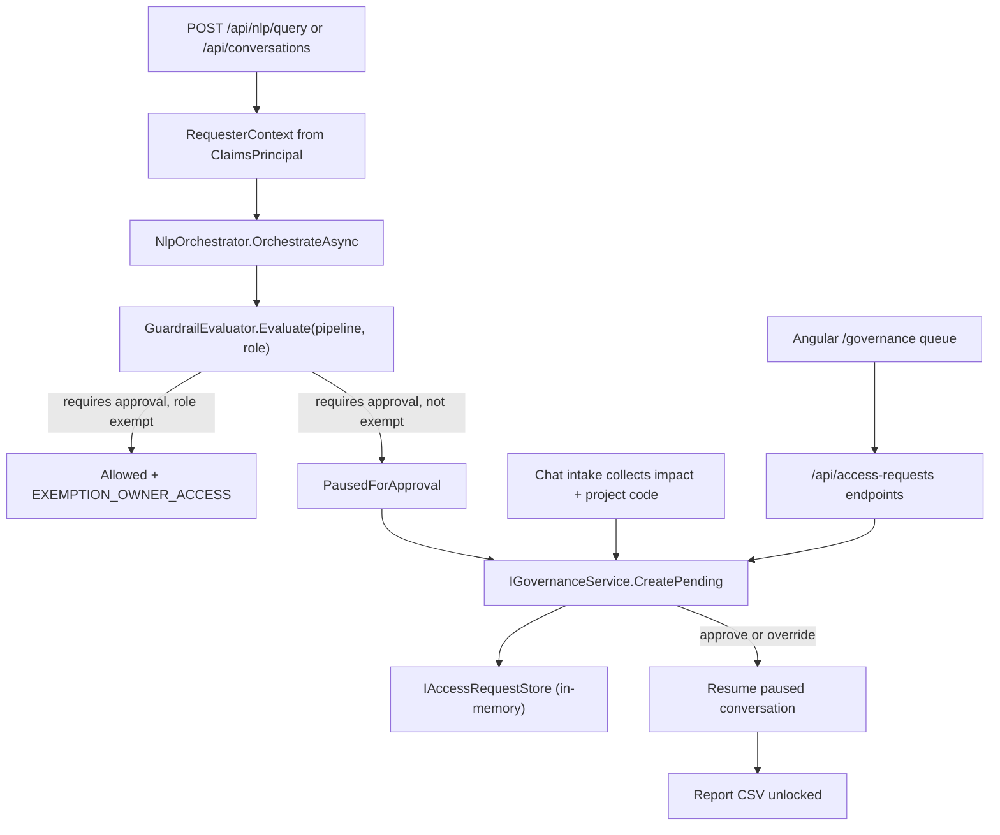

# Sprint 5 — RBAC Exemptions, Lead Approval, and Manager Override Design

**Date:** 2026-09-25
**Status:** Draft for review
**Owner:** Bikash Ranjan Nayak
**Deliverable:** Data Owner exemption, Team Lead approval queue with paused-state resume, and Engineering Manager override in the ASP.NET Core gateway plus an Angular governance portal

---

## 1. Goal

Complete the hierarchical governance workflow that Sprint 4 started. Today a sensitive query
creates a `PENDING_LEAD` access request and pauses the agent, but nothing can resolve it. This
sprint adds three things: a Data Owner exemption that avoids the queue entirely, a Team Lead
approval path that resolves a request and resumes the paused report, and a managerial override
that lets a manager, director, or data owner claim and sign off someone else's queue item. It
also adds the Angular governance portal where these decisions are made.

## 2. Audience and success criteria

- **Primary audience:** business analysts raising sensitive-data requests, and the leads,
  managers, directors, and data owners who resolve them.
- **Success looks like:** an analyst asks for sensitive data, supplies the business reason,
  impact, and project code in the chat, and sees the request pending. Their Team Lead opens the
  governance portal, approves it, and the analyst can then download the report. A data owner
  asking the same query is never queued. An Engineering Manager can override a request assigned
  to someone else and the record shows the override, actor, time, and notes.

## 3. Scope

**In scope**

- Role-aware requester context captured from the JWT and stored on the access request.
- Data Owner exemption: per-field `data_owner_roles` matched against the user's role, with no
  queue item created and an `EXEMPTION_OWNER_ACCESS` tag.
- Lead approval queue: requests assigned to the requester's `lead_user_id`, with approve and
  reject decisions that transition the request lifecycle.
- Managerial override: Engineering Manager, Director, or Data Owner / Admin claims and
  approves a `PENDING_LEAD` item, tagged `override_invoked` with
  `HIERARCHICAL_MANAGEMENT_OVERRIDE`, actor, timestamp, and notes.
- Paused-state resume: an approved request unblocks its conversation and makes the report CSV
  available (NFR-13).
- Business justification captured in the guided intake for approval-gated queries.
- Angular governance portal: a role-scoped queue with approve, reject, and override actions.
- All state in-memory; `IAccessRequestStore`, `IConversationStore`, and `IAgentStateStore`
  remain in-memory this sprint.

**Out of scope**

- Real MongoDB execution of the approved pipeline and immutable `audit_logs` writes (Sprint 6).
- Real SMTP delivery and durable paused-state persistence in MongoDB (Sprint 6/7).
- Admin analytics and narrative insights (Sprint 7).
- Editing the justification after the chat intake is submitted.
- Any change to the read-only, schema whitelist, or field-sensitivity guardrail rules.

## 4. Confirmed decisions

| Topic | Decision |
| --- | --- |
| Architecture | Keep `AccessRequest` in `Gateway.Nlp.Guardrails`; add a thin `IGovernanceService` seam for exemption, queue, lifecycle, and resume |
| Persistence | In-memory stores only; real Mongo is Sprint 6 |
| Justification | Collected in the chat intake on approval-gated queries; shown read-only in the portal |
| Resume | Approval unblocks the linked conversation and enables CSV download; reject is terminal |
| Exemption matching | Normalize and alias roles; exempt when the user's role tokens intersect the field's `data_owner_roles` |
| Override authority | Engineering Manager, Director, or Data Owner / Admin; Director is added to the known roles |
| Queue scoping | Analyst sees own; Team Lead sees items assigned to them; manager/director/owner see all pending |
| Portal shape | New `/governance` route with a queue and per-item actions |
| Wire enums | Status and override type are strings on the wire |
| New packages | None on either the gateway or the SPA |

## 5. Current state

Sprint 4 and the report-intake slice already provide:

- `GuardrailEvaluator` pauses a query when a matched field has `requires_approval` and the
  global `Governance:ApprovalEnabled` flag is on.
- `NlpOrchestrator.OrchestrateAsync` creates an `AccessRequest` with status `PENDING_LEAD`,
  saves an `AgentState` with stage `governance_paused`, and publishes `governance.paused`.
- `ConversationOrchestrator.StartAsync` opens the guided intake for report-producing and
  paused queries and stores `AccessRequestId` and `SensitiveFields` on the conversation state.
- `ConversationOrchestrator.FinalizeAsync` attaches the collected `ReportIntake` to the access
  request and simulates the manager notification.
- Role claims available per user: `user_id`, `name`, `email`, `role`, `lead_user_id`.

What is missing: requester identity on the request, the business impact justification, the
exemption check, any endpoint to list or resolve requests, the resume after approval, and the
portal.

## 6. Architecture overview



The `IGovernanceService` seam owns every governance decision so that `NlpOrchestrator`,
`ConversationOrchestrator`, the endpoints, and the tests share one implementation. It depends on
`IAccessRequestStore`, `IConversationStore` (for resume lookup), `IAgentStateStore`, the agent
event sink, and the clock.

## 7. Domain model

All changes to existing positional records append trailing optional parameters with defaults, so
current call sites keep compiling.

`AccessRequest` gains:

```csharp
public sealed record AccessRequest(
    string Id,
    string SessionId,
    string Mql,
    IReadOnlyList<string> SensitiveFields,
    string Status,
    string? Justification,
    DateTimeOffset CreatedAt,
    ReportIntake? Intake = null,
    RequesterInfo? Requester = null,
    string? AssignedLeadId = null,
    IReadOnlyList<RequestedFlag>? RequestedFlags = null,
    GovernanceJustification? JustificationDetails = null,
    ApprovalResolution? Resolution = null)
{
    public const string PendingLead = "PENDING_LEAD";
    public const string Approved = "APPROVED";
    public const string Rejected = "REJECTED";
}
```

New records in `Gateway.Nlp.Guardrails`:

```csharp
public sealed record RequesterInfo(string UserId, string Name, string Role, string? LeadUserId);

public sealed record RequestedFlag(string FieldPath, string Flag);

public sealed record GovernanceJustification(
    string BusinessReason,
    string BusinessImpact,
    string? ProjectCode);

public sealed record ApprovalResolution(
    string AssignedLeadId,
    string ResolvedByUserId,
    string ResolvedByName,
    string ResolvedByRole,
    bool OverrideInvoked,
    string? OverrideType,
    DateTimeOffset ResolvedAt,
    string? Notes)
{
    public const string HierarchicalManagementOverride = "HIERARCHICAL_MANAGEMENT_OVERRIDE";
}
```

`RequestedFlag.Flag` uses the literal `"requires_approval"` for the gate.

`AgentState` gains a trailing `string? AccessRequestId = null` so the paused session and the
access request are linked for resume.

## 8. Requester context and role normalization

`RequesterContext(UserId, Name, Role, LeadUserId?)` is built once per request by
`SessionClaims.ToRequesterContext(ClaimsPrincipal)` and threaded through
`INlpOrchestrator.OrchestrateAsync(..., RequesterContext? requester = null)` and
`ConversationOrchestrator.StartAsync(..., RequesterContext? requester = null)`. Both parameters
are trailing and optional, so existing positional calls keep working.

`RoleNormalizer` handles the seed/claim mismatch. `dataOwnerRoles` in `field_registry.json` are
`["DataOwner", "Admin"]` while the JWT claim is `"Data Owner / Admin"`. The normalizer lowercases
a role and removes every non-alphanumeric character, so both sides reduce to comparable tokens:

```csharp
public static string Normalize(string role);          // "Data Owner / Admin" -> "dataowneradmin"
public static bool Matches(string claimRole, string ownerRole); // normalized containment either way
```

`Matches` returns true when either normalized string contains the other, so
`"dataowneradmin"` matches `"dataowner"` and `"admin"`, but not `"teamlead"`.

`SessionClaims.Roles` gains `"Director"` so the role is a first-class known role. The development
token keeps its existing `Data Owner / Admin` claim.

## 9. Data Owner exemption

`GuardrailEvaluator.Evaluate(string? pipelineJson, string? requesterRole = null)` stays pure and
uses the matched registry flags, which already carry `DataOwnerRoles`. When every field with
`requires_approval` is owned by the requester role (per `RoleNormalizer.Matches`) and the global
flag is on, the evaluator returns `Allowed` with a trailing `string? ExemptionType` on
`GuardrailResult` set to `EXEMPTION_OWNER_ACCESS` and the sensitive fields populated.

The orchestrator, on seeing a non-null `ExemptionType`, publishes `governance.exempted` and does
not create an access request or pause the session. When the global flag is off, the existing
behaviour is unchanged: no pause and no exemption tag, because there is no gate to exempt.

## 10. Lead approval queue and lifecycle

`IGovernanceService` exposes:

```csharp
Task<AccessRequest> CreatePendingAsync(AccessRequest request, CancellationToken ct = default);
Task<IReadOnlyList<AccessRequest>> ListAsync(RequesterContext viewer, string? status = null, CancellationToken ct = default);
Task<AccessRequest?> GetAsync(string id, CancellationToken ct = default);
Task<AccessRequest> ApproveAsync(string id, RequesterContext actor, string? notes, CancellationToken ct = default);
Task<AccessRequest> RejectAsync(string id, RequesterContext actor, string? notes, CancellationToken ct = default);
Task<AccessRequest> OverrideAsync(string id, RequesterContext actor, string notes, CancellationToken ct = default);
bool IsDataOwner(RequesterContext context);
```

Queue scoping in `ListAsync`:

- **Business Analyst:** only requests where `Requester.UserId == viewer.UserId`.
- **Team Lead:** only requests where `AssignedLeadId == viewer.UserId`.
- **Engineering Manager, Director, Data Owner / Admin:** all `PENDING_LEAD` requests, plus
  previously resolved requests for visibility.
- An optional `status` filter is applied on top of the scoped set.

`AssignedLeadId` is set from `Requester.LeadUserId` at creation time. Approval rules:

- The assigned lead, or any viewer whose id equals `AssignedLeadId`, approves normally:
  `OverrideInvoked = false`, `OverrideType = null`.
- A manager, director, or data owner who is not the assignee approves as an override:
  `OverrideInvoked = true`, `OverrideType = HIERARCHICAL_MANAGEMENT_OVERRIDE`. `OverrideAsync`
  additionally requires non-empty notes and is rejected with 400 when notes are missing.
- A Team Lead who is not the assignee, or a Business Analyst, receives 403.

`ApproveAsync` and `OverrideAsync` both set status `APPROVED`, fill `Resolution` with the actor
identity and clock timestamp, and then call the resume handler. `RejectAsync` sets status
`REJECTED` with a resolution and never resumes.

## 11. Resume semantics (NFR-13)

`IConversationStore` gains
`Task<ConversationState?> FindByAccessRequestAsync(string accessRequestId, CancellationToken ct = default)`.

The resume hand-off is expressed as an interface, `IConversationResumeHandler`, with
`Task<bool> ResumeAsync(string accessRequestId, CancellationToken ct = default)`, implemented by
`ConversationOrchestrator`. `GovernanceService` depends on that interface rather than on the
concrete orchestrator. To avoid a DI cycle, `ConversationOrchestrator` keeps using
`IAccessRequestStore` for intake enrichment and does not depend on `IGovernanceService`; the only
edge between the two is `GovernanceService -> IConversationResumeHandler`.

When a paused conversation is found, resume sets `ApprovalRequired = false`, publishes
`report.ready` when the delivery format is CSV, publishes `conversation.resumed`, and returns
true. When no conversation is linked (for example a direct `/api/nlp/query` with no chat), resume
is a no-op that returns false and only the access request changes.

On approval the governance service publishes `governance.approved`; on rejection it publishes
`governance.rejected`. Because the conversation is already at the `Complete` step, resume only
lifts the hold; the CSV download endpoint already requires `ApprovalRequired == false`.

## 12. Justification capture in the chat

The guided intake adds a `BusinessImpact` step between `Purpose` and `ManagerEmail` only when the
conversation is approval-gated (`state.Kind == NlpRouteKind.GovernancePaused`). Non-gated report
conversations keep their current five steps.

- `ConversationStep` gains `BusinessImpact`, placed in flow order after `Purpose`. No code
  compares steps by ordinal (only equality and `switch`), and the wire value is the enum name, so
  the shift in ordinal values is safe.
- `ConversationControl` gains `BusinessImpact`.
- `ReportIntakeDraft` gains a trailing `string? BusinessImpact = null`.
- Validation on the gated path: purpose (business reason) 8-500 characters, business impact
  8-500 characters, and a non-empty project code. Non-gated conversations keep project code
  optional as today.
- `FinalizeAsync` builds `GovernanceJustification(Purpose, BusinessImpact, ProjectCode)` and sets
  `JustificationDetails` and `Justification = Purpose` on the access request, alongside the
  existing `Intake` attachment.

The portal shows the three justification fields read-only.

## 13. API surface

All endpoints require authorization. Enums and statuses are strings.

| Method | Route | Body | Behaviour |
| --- | --- | --- | --- |
| GET | `/api/access-requests?status=` | none | Role-scoped queue |
| GET | `/api/access-requests/{id}` | none | Single request; 404 if absent, 403 if present but outside the viewer's scope |
| POST | `/api/access-requests/{id}/approve` | `{ notes? }` | Assigned lead or manager/owner override approval |
| POST | `/api/access-requests/{id}/reject` | `{ notes? }` | Terminal rejection |
| POST | `/api/access-requests/{id}/override` | `{ notes }` | Manager/director/owner override, notes required |

Responses return the updated access request. Error mapping:

- 400 when override notes are empty or another validation fails.
- 403 when the role or assignment does not permit the action.
- 404 when the request does not exist.
- 409 when the request is not `PENDING_LEAD` (already resolved).

The existing governance flag endpoints and chat endpoints are unchanged.

## 14. Angular governance portal

- New route `/governance` and a navigation link, registered in the standalone app routing.
- `governance.service.ts` gains `list(status?)`, `approve(id, notes?)`, `reject(id, notes?)`, and
  `override(id, notes)` against the new endpoints; the existing approval-flag methods stay.
- `models/governance.ts` defines `AccessRequest`, `RequesterInfo`, `RequestedFlag`,
  `GovernanceJustification`, and `ApprovalResolution` matching the JSON.
- `GovernanceQueueComponent` lists the scoped requests as cards. Each card shows the requester,
  status, sensitive fields, justification, and (when pending) Approve, Reject, and Override
  actions. Override requires notes and is disabled otherwise. Buttons are hidden for viewers who
  lack the authority; the server remains the source of truth.
- The chat pause state shows the captured justification and, for approvers, a link to
  `/governance`.
- After any action the queue refreshes; SSE already carries `governance.approved` and
  `governance.rejected` for clients that subscribe.

## 15. Error handling and fail-closed behaviour

- Only `PENDING_LEAD` requests can transition; everything else is 409.
- Missing or unknown request ids are 404.
- Authorization is enforced server-side from JWT role and assignee, never from client hints.
- Override without notes is 400.
- Resume failures do not corrupt the request: the status transition is committed first and the
  resume is best-effort with a logged event.
- Exemption is evaluated only for fields that actually require approval, so a non-sensitive query
  never receives an exemption tag.

## 16. Testing strategy

- **Unit:** `RoleNormalizer` matching (`Data Owner / Admin` vs `DataOwner`/`Admin`); exemption
  decision per field; lifecycle transitions and authorization for approve, reject, override; the
  resume lookup and hold lift; the `BusinessImpact` intake step and validation.
- **API integration:** queue scoping for each of the four roles; approve/reject/override returning
  200/400/403/404/409; an exempt data owner bypassing the queue; approval unblocking the CSV
  download; rejection leaving it blocked.
- **Angular:** `governance.service.ts` request shaping and `GovernanceQueueComponent` rendering and
  role-gated actions.
- No new test packages. Gateway tests run under `net10.0`; the SPA uses the existing vitest/jsdom
  setup.

## 17. Acceptance criteria

- [ ] Data Owner / Admin executes sensitive queries without a pending request (BRD-FR-06)
- [ ] Business Analyst sensitive query creates `PENDING_LEAD` and requires justification
- [ ] Team Lead can approve subordinate requests and resume execution
- [ ] Engineering Manager / Director / Data Owner can claim and approve `PENDING_LEAD` items (BRD-FR-07)
- [ ] Override records `override_invoked`, actor, timestamp, justification
- [ ] Paused SK state survives the hold and resumes after `APPROVED`
- [ ] The governance portal is visible and usable only for authorized roles

## 18. Non-goals and risks

- **Not real execution.** Approval unblocks the in-memory demo report; the approved pipeline is
  not run against MongoDB until Sprint 6.
- **Not durable.** Requests, conversations, and paused states are lost on restart, as in Sprint 4.
- **Seed/claim mismatch.** The normalizer masks a genuine data inconsistency; a future sprint
  should align the seed with the claim or make the mapping explicit configuration.
- **Manager email vs approver.** The chat's manager email is a notification recipient; the actual
  approver is derived from `lead_user_id` and role. They may differ and the portal is authoritative.
- **Role coverage.** Director is added to the known roles but no directory integration exists; the
  JWT must carry the claim.

## 19. Main new and changed files

- `src/gateway/Governance/IGovernanceService.cs`, `GovernanceService.cs`, `RoleNormalizer.cs`,
  `RequesterContext.cs` — governance seam, normalization, and requester identity.
- `src/gateway/Nlp/Guardrails/AccessRequest.cs`, `RequestedFlag.cs`, `RequesterInfo.cs`,
  `GovernanceJustification.cs`, `ApprovalResolution.cs`, `GuardrailResult.cs`,
  `GuardrailEvaluator.cs` — model and exemption changes.
- `src/gateway/Auth/SessionClaims.cs` — `ToRequesterContext` and the `Director` role.
- `src/gateway/Nlp/Orchestrator/{INlpOrchestrator,NlpOrchestrator,AgentState}.cs` — requester
  threading, exemption event, request enrichment.
- `src/gateway/Conversations/{ConversationOrchestrator,ConversationStep,ConversationControl,
  IConversationStore,InMemoryConversationStore,ReportIntakeDraft,IConversationResumeHandler}.cs` — impact step and resume.
- `src/gateway/Nlp/NlpServiceCollectionExtensions.cs`, `src/gateway/Program.cs` — DI and endpoints.
- `src/web/src/app/governance/` — `governance-queue.component.*`, `governance.service.ts`,
  `models/governance.ts`, routing and nav.
- `tests/Gateway.Tests/Governance/` and `tests/Gateway.Tests/ApiGovernanceTests.cs` — unit and API
  coverage; `src/web/src/app/governance/*.spec.ts` — SPA coverage.
