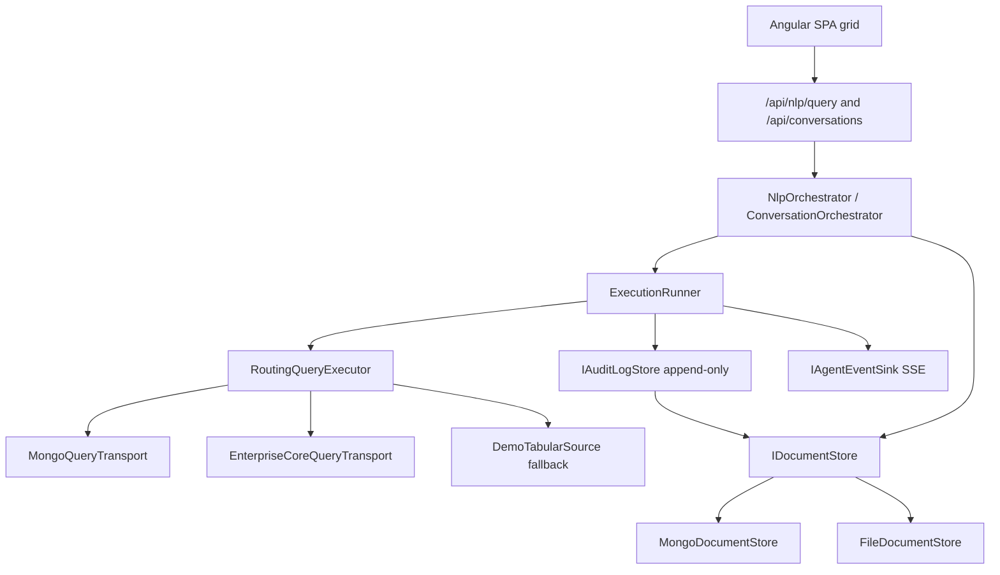

# Sprint 6 — Execution Runner, Dual Ingestion, and Immutable Audit Design

**Date:** 2026-09-28
**Status:** Draft for review
**Owner:** Bikash Ranjan Nayak
**Deliverable:** A read-only Execution Runner that targets MongoDB or Enterprise Core REST behind one policy, an append-only `audit_logs` trail written on every execution, durable governance holds, and an Angular results grid

---

## 1. Goal

Sprint 5 made sensitive requests resolvable, but nothing executes a pipeline: the CSV download
still returns in-memory demo rows, the guardrail result is returned to the SPA without data, and
all pause state is lost when the gateway recycles. This sprint closes the loop. After a guardrail
pass (or an owner exemption, or an approved hold) the gateway runs the validated read-only MQL
against MongoDB or the Enterprise Core REST API, returns tabular JSON to the SPA, and appends one
complete BRD 6.1 `audit_logs` document every time. It also replaces the three in-memory stores used
by the governance hold with durable backends so an approval can still resume a paused conversation
after a restart.

## 2. Audience and success criteria

- **Primary audience:** business analysts running governed queries, the leads and owners who
  approve them, and the platform operators who need a trustworthy execution record.
- **Success looks like:** an analyst asks a question, sees the rows in a grid, and downloads a CSV
  built from real query results. A sensitive question pauses, is approved, and then returns rows
  and a CSV from the real execution. A data owner asking the same question is never queued and the
  audit row records the exemption. Every one of those executions has exactly one append-only
  `audit_logs` document tying together the user, the NLP cost, the query, the result count, and the
  governance decision. Restarting the gateway does not lose a pending approval.

## 3. Scope

**In scope**

- Read-only Execution Runner with a hard 5,000 ms timeout; timeouts are cancelled and still audited.
- Dual ingestion: one policy selects the MongoDB driver path or the Enterprise Core REST path; the
  client never chooses the transport and both paths return the same tabular contract.
- Append-only `audit_logs` matching BRD 6.1, with no update or delete path in code.
- Durable stores for agent state, access requests, and conversations so a governance hold survives
  a gateway restart (BRD-NFR-13).
- Execution wired into both entry points: the direct `/api/nlp/query` path and the report-intake
  conversation, including execution on approval resume.
- Angular results grid bound to the execution payload, plus the existing CSV download fed by real
  rows instead of demo rows.
- `agent.executing` and `agent.completed` SSE events around execution.

**Out of scope**

- CSV/XLSX/PDF export agents, in-memory export guarantees, and SMTP PDF dispatch (Sprint 7).
- Admin analytics aggregations over `audit_logs` (Sprint 7).
- Narrative insights and briefing text (Sprint 7).
- Any write or admin operator against listings; the read-only guardrail is unchanged.
- Editing a submitted justification, and any new role or approval rule.
- Direct client access to MongoDB or NVIDIA; the browser only ever calls the gateway.

## 4. Confirmed decisions

| Topic | Decision |
| --- | --- |
| New dependency | Add `MongoDB.Driver` to `src/gateway`; no new npm package |
| Persistence strategy | Real MongoDB driver adapters plus a file-backed dev fallback selected at startup |
| Durable scope | One persistence seam backs agent state, access requests, and conversations so a full hold survives restart |
| Execution placement | Both the direct query path and the report conversation execute |
| Transport policy | Server-side `Execution:DataSource` policy picks the transport; same result contract for both |
| Timeout | 5,000 ms default via a linked cancellation token; timeout produces an audited error result |
| Audit | Append-only; the store interface has append and read methods only |
| Enterprise Core REST | Typed `HttpClient` plus a Development-only stub endpoint that returns the same tabular contract |
| Export | The existing CSV path stays and is now fed real rows; XLSX/PDF/SMTP remain Sprint 7 |
| Scenario without backends | A demo tabular source keeps preview working when neither backend is reachable |
| Wire enums | Statuses, data sources, and exemption tags remain strings on the wire |

## 5. Current state

Sprints 4 and 5 and the report-intake slice already provide:

- `GuardrailEvaluator.Evaluate(mql, role)` returns `Allowed`, `Rejected`, `PausedForApproval`, or an
  exemption via `ExemptionType`.
- `NlpOrchestrator.OrchestrateAsync` routes, generates MQL, evaluates the guardrail, creates a
  `PENDING_LEAD` access request with a requester and justification, saves an `AgentState`, and
  publishes `governance.paused` / `governance.exempted`.
- `GovernanceService` resolves approvals and overrides and calls `IConversationResumeHandler.ResumeAsync`.
- `ConversationOrchestrator` runs the guided intake, finalizes into a `ConversationState`, and
  `ResumeAsync` lifts the hold, emitting `conversation.resumed` and `report.ready`.
- `ReportService.BuildCsv` exports `DemoListingSource.Rows()` through `CsvExporter`.
- `NlpQueryResponse` and `ConversationTurn` are the two HTTP contracts the SPA consumes.
- All three stores are in-memory; `MongoDb` config exists but no driver is referenced.

Missing this sprint: the execution itself, the tabular contract, the audit document and store, the
durable stores, the grid, and the `agent.executing` / `agent.completed` events.

## 6. Architecture overview

Three new namespaces plus small edits to the existing orchestrators.

- **`Gateway.Persistence`** owns the generic document seam and the Mongo/File adapters.
- **`Gateway.Execution`** owns the request/result contracts, the transports, the routing policy, the
  timeout, and the runner.
- **`Gateway.Audit`** owns the BRD 6.1 document, the append-only store interface, and its adapters.
- The existing orchestrators call the runner and the audit store through narrow interfaces so they
  stay unit-testable without a live backend.

## 7. Persistence seam

### 7.1 `IDocumentStore`

A single generic seam over opaque documents keyed by collection and string id:

- `Task<T?> GetAsync<T>(string collection, string id, CancellationToken)`
- `Task<IReadOnlyList<T>> GetAllAsync<T>(string collection, CancellationToken)`
- `Task UpsertAsync<T>(string collection, string id, T document, CancellationToken)`

There is deliberately no delete. Documents are serialized with `System.Text.Json` at the seam so
both adapters share one representation.

### 7.2 Adapters

- `MongoDocumentStore` maps each logical collection to a Mongo collection and stores the serialized
  document as BSON, using the entity id as `_id`. Reads deserialize back to `T`.
- `FileDocumentStore` writes one JSON file per id under `Persistence:DataDirectory`, grouped by
  collection, and reads them back on demand. This is the durable dev fallback.
- `DocumentStoreFactory.Create(configuration, environment)` selects the adapter at startup:
  `Persistence:Mode` is `auto` (default), `mongo`, or `file`. In `auto` it attempts a short Mongo
  ping and falls back to file on failure, logging which backend won. `mongo` fails fast if Mongo is
  unreachable; `file` never contacts Mongo.

### 7.3 Store adapters

The three governance-hold stores are reimplemented over `IDocumentStore`, keeping their existing
interfaces so no consumer changes:

- `DurableAgentStateStore : IAgentStateStore` keyed by `SessionId`.
- `DurableAccessRequestStore : IAccessRequestStore` keyed by `Id`.
- `DurableConversationStore : IConversationStore`, including `FindByAccessRequestAsync` by scanning
  `GetAllAsync` for the matching `AccessRequestId`.

The in-memory implementations stay in the codebase for tests and are still used by
`GatewayFactory`. DI selects durable or in-memory stores by configuration so tests remain fast and
hermetic.

## 8. Execution Runner

### 8.1 Contracts

- `ExecutionRequest` carries the validated MQL, the resolved `DataSource`, the session id, the
  requester, the NLP metrics (cache hit, slot extraction, tokens), the summary utterance, the
  applied clarifications, the target collection, the sensitive fields, and the governance decision
  (none, exemption, or approved override).
- `TabularResult` carries `Columns`, `Rows` (each row a string-keyed value map), `RowCount`,
  `DataSource`, `DurationMs`, `TimedOut`, and an optional `Error`.
- `IQueryTransport.ExecuteAsync(ExecutionRequest, CancellationToken)` returns a `TabularResult`
  without enforcing the timeout; the runner owns the deadline.
- `ITabularQueryExecutor.ExecuteAsync(ExecutionRequest, CancellationToken)` is the seam the
  orchestrators depend on.

### 8.2 Transports

- `MongoQueryTransport` uses `MongoDB.Driver` against `Execution:Collection` (default
  `listingsAndReviews`) in the configured database, parsing the MQL JSON array into BSON stages and
  running an aggregation. Rows are projected to the selected columns; missing paths are null.
- `EnterpriseCoreQueryTransport` posts the MQL to `EnterpriseCore:QueryPath` on a typed `HttpClient`
  bound to `EnterpriseCore:BaseUrl`, and maps the response body to the same `TabularResult`. It is
  registered with `AddHttpClient` and a per-request timeout above the execution deadline.
- `DemoTabularSource` is the final fallback used only when the selected transport cannot reach its
  backend and `Reports:DemoFallbackEnabled` is on; it returns `DemoListingSource` rows mapped to the
  tabular contract. In Production this flag is already `false`, so the failure surfaces instead.

### 8.3 Routing

`RoutingQueryExecutor` selects a transport from server policy, never from the client:

- An `ExecutionDataSource` enum of `Mongo` and `EnterpriseCoreREST`; `Execution:DataSource` sets the default.
- The policy resolves the source from configuration; an explicit per-request source is not accepted
  from the SPA. Both transports satisfy one contract, so the caller does not branch on transport.

### 8.4 Timeout

`ExecutionRunner` wraps the transport call in a `CancellationTokenSource` linked to the request
token with `Execution:TimeoutMs` (default 5,000). On timeout it cancels, records `TimedOut = true`
and an error string in the `TabularResult`, and continues to audit. The runner then:
publishes `agent.executing` before the call and `agent.completed` after it, and hands the result plus
the execution context to the audit store. The runner never throws to the caller for a backend or
timeout failure; failures are represented in the result and the audit row.

## 9. Append-only audit trail

### 9.1 Document

`AuditLogDocument` mirrors BRD 6.1 exactly:

- `AuditTimestamp`, `SessionId`, `DataSource`.
- `User`: `UserId`, `Name`, `Email`, `Role`.
- `NlpPerformance`: `SemanticCacheHit`, `SlotExtractionUsed`, `LlmTokensConsumed`,
  `ExecutionDurationMs`.
- `RequestDetails`: `NaturalLanguagePrompt`, `ClarificationsApplied` (the MQL defaults that were
  applied at synthesis time).
- `ExecutionDetails`: `GeneratedQuery`, `TargetCollection`, `RowsReturned`, `ExportFormat`, and an
  optional `Error` used for timeouts and transport failures.
- `Governance`: `SensitiveDataAccessed`, `FlagsTriggered`, `ExemptionType`, `OverrideInvoked`,
  `AuthorizedBy`.

`AuthorizedBy` is the requester for an exemption, the resolver for an approved request, and null for
an ungated execution.

### 9.2 Store

- `IAuditLogStore` exposes `AppendAsync` and read methods (`GetAsync`, `ListAsync`) only; there is no
  update or delete method.
- `MongoAuditLogStore` and `FileAuditLogStore` back onto `IDocumentStore` under an `audit_logs`
  collection; `InMemoryAuditLogStore` serves tests.
- A reflection test asserts the interface and the implementations expose no mutation method, which
  is the executable form of BRD-NFR-09.

### 9.3 Mapping

An `AuditLogFactory` builds the document from the `ExecutionRequest`, the `TabularResult`, the
`RequesterContext`, and resolved governance metadata. The orchestrators pass the NLP metrics and the
clarifications they already compute; nothing is recomputed.

## 10. Wiring into the flows

### 10.1 Direct path

`NlpOrchestrator` gains an `ITabularQueryExecutor` dependency. After the guardrail returns
`Allowed` or an exemption, it executes and returns the tabular payload on `NlpRouteResult` as
trailing optional members (`Columns`, `Rows`, `DataSource`, `RowCount`, `DurationMs`). The audit row
is written inside the execution flow. `NlpQueryResponse.From` copies the payload through, and the
`/api/nlp/query` endpoint is unchanged in shape apart from the added response fields.

### 10.2 Conversation path

`ConversationOrchestrator.FinalizeAsync` executes the MQL when `ApprovalRequired` is false, stores
the `TabularResult` on `ConversationState`, and emits the execution events. `ApprovalRequired` stays
true for paused requests: they execute on resume instead. The conversation's CSV path uses the
stored rows when present and falls back to demo rows only under `Reports:DemoFallbackEnabled`.

### 10.3 Resume path

`ConversationOrchestrator.ResumeAsync` executes the stored MQL after lifting the hold, stores the
`TabularResult`, and publishes `report.ready` only after a successful execution. This is the
acceptance path for "sensitive query after approval returns listing rows".

### 10.4 Contracts

- `ConversationTurn` gains an optional `Execution` payload as a trailing parameter.
- `ReportService.BuildCsv` gains an overload that accepts executed rows and columns; the existing
  demo-based call remains for the demo fallback.

## 11. SSE events

- `agent.executing` with the chosen data source, published before the transport call.
- `agent.completed` with the row count and duration, published after the call, including on timeout
  or failure.
- Existing events (`governance.*`, `conversation.*`, `report.ready`) are unchanged.

## 12. Angular results grid

- New standalone `ResultsGridComponent` rendering the tabular payload with sticky headers, a row
  count, the data source, and the duration. Plain Angular and CSS, no new UI library.
- The workspace query result renders the grid when a direct query returns rows.
- The chat thread renders the grid when a conversation turn carries an execution payload, including
  after an approval resume.
- The grid is read-only and performs no client-side querying.

## 13. Configuration

New sections added to `appsettings.json`:

- `Execution`: `DataSource` (`Mongo` default), `TimeoutMs` (5000), `Collection`
  (`listingsAndReviews`).
- `EnterpriseCore`: `BaseUrl` (empty), `QueryPath` (`/api/query`).
- `Persistence`: `Mode` (`auto`), `DataDirectory` (`.data`).

`.data/` is added to `.gitignore`. Production keeps `Reports:DemoFallbackEnabled` false so a
missing backend is a visible, audited failure.

## 14. Error handling

- Transport exception: result carries `Error`, `RowCount` 0, and the audit row records the error.
- Timeout: result carries `TimedOut` and the timeout error, and the audit row records it.
- Missing backend with fallback disabled: the same failure shape; never a silent demo row.
- Execution never turns a guardrail rejection into an execution; only `Allowed`, exemption, or an
  approved hold reach the runner.
- Audit write failure is logged and surfaced as an execution error but does not fabricate success.

## 15. Testing strategy

- **Persistence:** file-backed `IDocumentStore` round-trips in a temp directory, including a
  restart simulation that reloads a saved hold; adapter selection in `auto`, `mongo`, and `file`.
- **Execution:** a fake `IQueryTransport` covers routing, result mapping, and the timeout path via
  a hanging transport that must be cancelled and audited.
- **Audit:** document mapping against a representative request; the reflection test for the absent
  mutation path; an in-memory store round-trip.
- **Orchestrator:** direct-path execution and approval-resume execution using a fake executor, with
  assertions on the audit append and the emitted `agent.*` events.
- **API:** `/api/nlp/query` returns columns and rows; the conversation CSV reflects executed rows.
- **SPA:** `ResultsGridComponent` renders columns and rows from a payload and shows an empty state.
- **No live MongoDB** is required in CI. Mongo adapter tests are guarded behind an environment flag
  and skip when Mongo is absent.

## 16. Acceptance mapping

| Sprint 6 acceptance criterion | Design element |
| --- | --- |
| Every execution writes a complete `audit_logs` document | `AuditLogFactory` + `IAuditLogStore.AppendAsync` in `ExecutionRunner` |
| Runner targets MongoDB or Enterprise Core REST without client change | `RoutingQueryExecutor` + two transports behind one contract |
| Queries over 5,000 ms are cancelled and audited | Linked-CTS timeout in `ExecutionRunner` with audit row |
| `audit_logs` has no update/delete path | Append-only interface plus reflection test |
| Sensitive query after approval returns listing rows | Resume-path execution in `ConversationOrchestrator.ResumeAsync` |
| Paused state survives a gateway restart | `IDocumentStore`-backed durable stores for state, requests, conversations |

## 17. Risks and mitigations

- **No MongoDB in this environment.** Mitigated by the file fallback and transport fakes; the Mongo
  adapter is exercised in guarded tests and by configuration, not by the default dev run.
- **Generic Mongo document mapping.** Mitigated by serializing through the same JSON seam as the
  file adapter and keying `_id` on the entity id.
- **Audit completeness drift.** Mitigated by a single `AuditLogFactory` and a mapping test against
  the BRD field list.
- **Durable conversations may grow unbounded in a single file directory.** Acceptable for the sprint
  scale; a retention policy is a later concern and not added now.

## 18. Files touched

- **New:** `src/gateway/Persistence/{IDocumentStore,FileDocumentStore,MongoDocumentStore,DocumentStoreFactory}.cs`,
  `src/gateway/Execution/{ExecutionRequest,TabularResult,ITabularQueryExecutor,IQueryTransport,MongoQueryTransport,EnterpriseCoreQueryTransport,DemoTabularSource,RoutingQueryExecutor,ExecutionRunner,ExecutionOptions,ExecutionDataSource}.cs`,
  `src/gateway/Audit/{AuditLogDocument,IAuditLogStore,InMemoryAuditLogStore,FileAuditLogStore,MongoAuditLogStore,AuditLogFactory}.cs`.
- **Changed:** `src/gateway/Nlp/Orchestrator/{NlpOrchestrator,NlpRouteResult}`, `Nlp/Http/NlpQueryResponse.cs`,
  `Conversations/{ConversationOrchestrator,ConversationState,ConversationTurn}`, `Reports/ReportService.cs`,
  `Nlp/NlpServiceCollectionExtensions.cs`, `Program.cs`, `src/gateway/gateway.csproj`, `appsettings.json`, `.gitignore`.
- **New SPA:** `src/web/src/app/results/results-grid.component.*` plus wiring in the workspace and chat components.
- **New tests:** persistence, execution, audit, and orchestrator suites under `tests/Gateway.Tests/`,
  and a results-grid spec under `src/web`.

## 19. Migration note

Existing in-memory store implementations remain and are selected by configuration for tests. The
default Development configuration uses `Persistence:Mode=auto`, which lands on the file backend in
this environment and on Mongo wherever a connection is reachable, so the same code path is exercised
either way.
