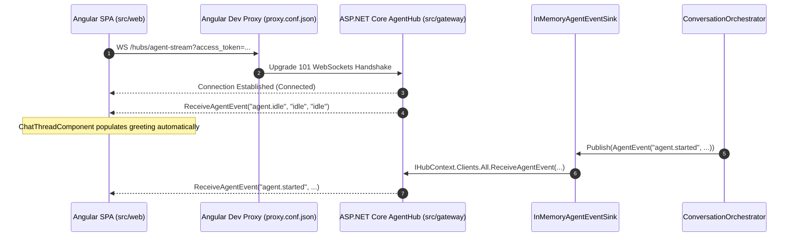

# Specification: Migration from SSE to SignalR Real-Time Event Hub

**Date:** 2026-10-05  
**Status:** Design Draft (Pending Verification)  
**Target Sprints:** Platform Optimization / Sprint 8  

---

## 1. Overview & Objectives

Migrate the real-time multi-agent event stream from standard HTTP Server-Sent Events (SSE) to **ASP.NET Core SignalR WebSockets**.

### Objectives
- Eliminate proxy buffering and `CONNECTING` delay when opening real-time streams locally.
- Enable automatic client reconnection and native hub connection state tracking.
- Provide a clean typed hub contract for backend multi-agent event dispatching.

---

## 2. Architecture & Components



---

## 3. Detailed Specifications

### A. Gateway Backend (`src/gateway`)

1. **Hub Contract (`Gateway/Hubs/IAgentHubClient.cs`)**:
   ```csharp
   namespace Gateway.Hubs;

   public interface IAgentHubClient
   {
       Task ReceiveAgentEvent(string eventName, string status, string detail);
   }
   ```

2. **Hub Implementation (`Gateway/Hubs/AgentHub.cs`)**:
   ```csharp
   using Microsoft.AspNetCore.Authorization;
   using Microsoft.AspNetCore.SignalR;

   namespace Gateway.Hubs;

   [Authorize]
   public sealed class AgentHub : Hub<IAgentHubClient>
   {
       public override async Task OnConnectedAsync()
       {
           await Clients.Caller.ReceiveAgentEvent("agent.idle", "idle", "idle");
           await base.OnConnectedAsync();
       }
   }
   ```

3. **Event Sink SignalR Dispatcher (`Gateway/Nlp/Orchestrator/InMemoryAgentEventSink.cs`)**:
   - Inject `IHubContext<AgentHub, IAgentHubClient>` into `InMemoryAgentEventSink`.
   - On `Publish(AgentEvent agentEvent)`, publish the event to `_hubContext.Clients.All.ReceiveAgentEvent(...)`.

4. **Program.cs Updates**:
   - Add SignalR services: `builder.Services.AddSignalR();`
   - Map Hub endpoint: `app.MapHub<AgentHub>("/hubs/agent-stream").RequireAuthorization();`
   - Update `JwtBearerEvents`:
     ```csharp
     OnMessageReceived = context =>
     {
         var accessToken = context.Request.Query["access_token"].ToString();
         var path = context.Request.Path;
         if (!string.IsNullOrEmpty(accessToken) &&
             (path.StartsWithSegments("/api/agents/stream") || path.StartsWithSegments("/hubs/agent-stream")))
         {
             context.Token = accessToken;
         }
         return Task.CompletedTask;
     }
     ```

---

### B. Angular SPA Frontend (`src/web`)

1. **Package Dependency (`package.json`)**:
   - Add `@microsoft/signalr` version `^8.0.0` or `^9.0.0`.

2. **Service Migration (`src/web/src/app/services/agent-stream.service.ts`)**:
   - Replace raw `EventSource` with `HubConnectionBuilder`:
     ```ts
     import { Injectable, NgZone } from '@angular/core';
     import { HubConnection, HubConnectionBuilder, HubConnectionState } from '@microsoft/signalr';
     import { Observable, Subject } from 'rxjs';
     import { SessionService } from './session.service';

     export interface AgentEvent {
       event: string;
       data: string;
     }

     @Injectable({ providedIn: 'root' })
     export class AgentStreamService {
       private hubConnection: HubConnection | null = null;
       private eventSubject = new Subject<AgentEvent>();

       constructor(private readonly session: SessionService, private readonly zone: NgZone) {}

       connect(): Observable<AgentEvent> {
         const token = this.session.token();
         this.hubConnection = new HubConnectionBuilder()
           .withUrl('/hubs/agent-stream', {
             accessTokenFactory: () => token ?? ''
           })
           .withAutomaticReconnect()
           .build();

         this.hubConnection.on('ReceiveAgentEvent', (eventName: string, status: string, detail: string) => {
           this.zone.run(() => {
             this.eventSubject.next({ event: eventName, data: JSON.stringify({ status, detail }) });
           });
         });

         this.hubConnection.start().catch(() => {
           this.zone.run(() => this.eventSubject.next({ event: 'sse-disconnected', data: 'error' }));
         });

         return this.eventSubject.asObservable();
       }
     }
     ```

3. **Angular Dev Proxy (`proxy.conf.json`)**:
   ```json
   {
     "/hubs": {
       "target": "http://localhost:5235",
       "secure": false,
       "changeOrigin": true,
       "ws": true
     },
     "/api": {
       "target": "http://localhost:5235",
       "secure": false,
       "changeOrigin": true
     }
   }
   ```

---

## 4. Verification Checklist

1. [ ] **ADR & Spec Verification**: Confirm design specifications with engineering lead before code modifications.
2. [ ] **Gateway Build & Tests**: Verify `dotnet test` passes with SignalR hub registered.
3. [ ] **SPA Build & Tests**: Verify `npm test` passes with `@microsoft/signalr` package wired into `AgentStreamService`.
4. [ ] **WebSocket Handshake Verification**: Verify local browser connects via WebSocket (`ws://localhost:4200/hubs/agent-stream`) with `< 10ms` startup connection latency.
5. [ ] **Event Delivery Verification**: Confirm `agent.idle` and orchestrator events stream directly into `ChatThreadComponent` and trigger auto-greeting.
