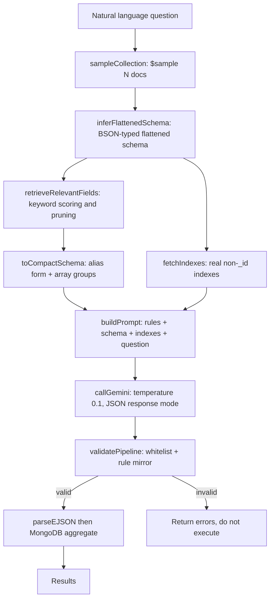
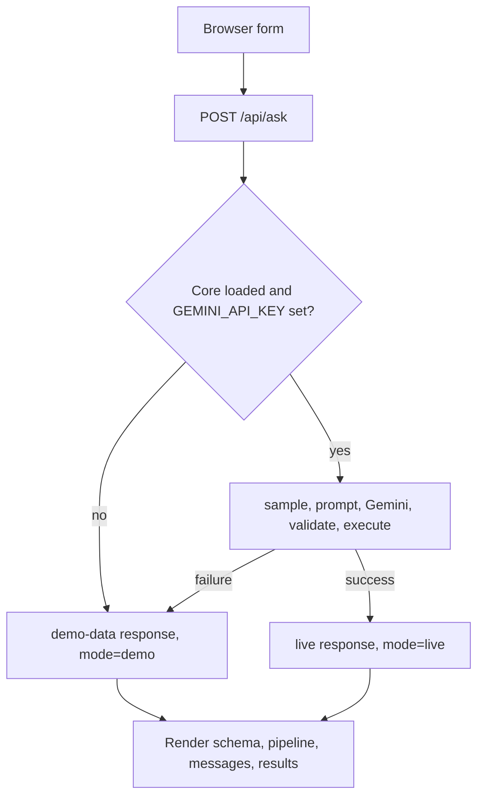

# mongo-ai-query (POC)

Natural language to MongoDB aggregation pipeline, powered by Gemini, with a
schema-aware prompt and a strict validator that mirrors every prompt rule.

This is a self-contained proof of concept. The core is a single CommonJS module
(`mongo-ai-query.js`) that also exposes an MCP server (`mcp-server.js.js`) so any
MCP-capable AI client can call it as tools.

---

## 1. Goals and non-goals

Goals:

- Turn a plain-English question into a validated MongoDB aggregation pipeline and
  execute it safely.
- Keep the prompt small (roughly 750-950 tokens) by sampling the collection,
  inferring a typed schema, pruning to relevant fields, and compressing to an
  alias form.
- Refuse anything outside a stage whitelist, and catch the most common
  correctness and type mistakes before executing.

Non-goals:

- No self-correction / retry loop. A pipeline is validated once; if it fails, the
  call returns errors and does not execute.
- No write operations. Only read stages are allowed.
- Not production-hardened (see "Known gaps" at the end).

---

## 2. Architecture



The same flow is wrapped by the MCP server, which caches schema and indexes per
collection for five minutes.

---

## 3. Directory contents

| File | Purpose |
| --- | --- |
| `mongo-ai-query.js` | Core library and CLI. Everything lives here. |
| `mcp-server.js.js` | MCP server exposing four tools over stdio. Imports the core. |
| `ui/` | Small zero-dependency web UI: Node server, single page, demo data, tests. |
| `MongoOfficialPrompt.txt` | The vanilla MongoDB prompt used as the prompt reference / baseline. |
| `ReadMe.txt` | Original short description. Superseded by this document. |
| `Setup&Install.txt` | Short install and run notes. |
| `.env` | Local environment values. Do not commit (see Security). |
| `package.json` / `package-lock.json` | Dependency manifest. |

Note: `mcp-server.js.js` has a doubled `.js` extension. It is intentional only in
the sense that it is the current name; `package.json` `main` points at it.

---

## 4. End-to-end flow

1. Sample the collection with `$sample` (`sampleCollection`, line 70). Default
   `SAMPLE_SIZE` is 200 documents. A collection with zero documents throws.
2. Fetch real indexes, excluding `_id_` (`fetchIndexes`, line 80). Failures are
   swallowed and treated as "no indexes".
3. Infer a flattened, BSON-typed schema from the sample
   (`inferFlattenedSchema`, line 116). See section 5.
4. Score and prune fields against the question
   (`retrieveRelevantFields`, line 273). See section 6.
5. Compress to the compact alias schema (`toCompactSchema`, line 234).
6. Build the prompt (`buildPrompt`, line 355). See section 7.
7. Call Gemini (`callGemini`, line 435), temperature `0.1`, JSON response MIME
   type. Optional context caching (section 8).
8. Parse EJSON to BSON values (`parseEJSON`, line 462).
9. Validate (`validatePipeline`, line 507). See section 9.
10. Execute with `.aggregate(...).limit(RESULT_LIMIT)` and print (CLI) or return
    (MCP).

---

## 5. Flattened schema inference

`inferFlattenedSchema` walks each sampled document and records, per flattened
path:

- `type`: one canonical type chosen by `pickType` (line 224) using a precedence
  order (objectId, date, decimal, long, binary, timestamp, regex, string,
  boolean, int, double, null, object).
- `allTypes`: every observed type when the field is polymorphic.
- `array`: true when the path is (or is inside) an array.
- `correlated`: true for arrays of objects whose element fields should be
  correlated via `$unwind`.
- `optional`: true when the path is absent in some sampled documents.
- `enum`: up to 15 distinct string values, but only when the field is present in
  at least 80 percent of the sample and has at most 25 distinct short values.

Pure `object` nodes (objects with only the `object` type) are dropped; their
children are promoted to flattened paths. Detected object arrays produce an
`arrays` map with `elementFields` and `correlated`.

Supported BSON detection (`bsonTypeOf`, line 94): `null`, `undefined`,
`ObjectId`, `Date`, `Decimal128`, `Long`, `Binary`, `Timestamp`, `RegExp`,
`Array`, `string`, `boolean`, `int` (integer number), `double`,
`bigint`, `object`.

---

## 6. Field retrieval (RAG-lite)

`retrieveRelevantFields` (line 273) splits the question into words longer than
two characters and scores every schema path:

- path contains the word: +5
- last path segment contains the word: +3
- an enum value contains the word: +2
- `_id`: +100

Paths are sorted by score. It keeps up to `MAX_FIELDS` (default 40), always
keeping at least the top 15 even with score zero, always keeping `_id`, and when
an array root is selected it also selects the root and all of its element
fields.

---

## 7. Prompt construction

`buildPrompt` (line 355) assembles, in order:

1. ROLE plus the required output shape.
2. `ALIAS_LEGEND` (line 316): alias table and the compact schema conventions.
3. `TYPE_RULES` (line 325): EJSON encoding that must be matched exactly.
4. `MONGO_RULES` (line 333): the 18 MongoDB best-practice rules.
5. `STAGES ALLOWED`: the `ALLOWED_STAGES` set.
6. `SCHEMA`: the compact schema JSON.
7. `INDEXES`: real indexes, when available.
8. `QUESTION` and `OUTPUT REQUIREMENTS` (a JSON array of stages, EJSON values, no
   markdown fences, `[]` when unanswerable).

### Compact schema format

```
ALIASES: oid=objectId str=string date=date dec=decimal lng=long int=int dbl=double bool=boolean bin=binary ts=timestamp rx=regex
CONVENTIONS:
  "f":"t"                    scalar
  "f":{"[]":"t"}             scalar array
  "f":{"[]":{...}}           array of objects
  "f":{"[]":{...},"corr":1}  correlated array -> MUST $unwind before correlating fields from it
  "*" suffix                 optional
  {"enum":[...]}             allowed values
```

### EJSON type encoding

| Schema type | EJSON form |
| --- | --- |
| date | `{"$date":"ISO8601"}` |
| oid | `{"$oid":"24-hex"}` |
| dec | `{"$numberDecimal":"str"}` |
| lng | `{"$numberLong":"str"}` |
| bin | `{"$binary":{"base64":"...","subType":"00"}}` |
| ts | `{"$timestamp":{"t":n,"i":n}}` |

---

## 8. Gemini call and caching

`callGemini` (line 435) uses `temperature: 0.1` and
`responseMimeType: 'application/json'`.

When `USE_CACHE=1`, `getCachedStatic` (line 402) creates a cached content entry
(one hour TTL) containing the static instruction block (legend, type rules,
Mongo rules, allowed stages, compact schema, indexes) and reuses it across calls.
The cache key is `model::collection::v3`. On any cache error it logs and falls
back to a normal, uncached call. Context caching requires a model that supports
it; the code normalizes the model name to `models/<name>-001` for the cache
request path.

---

## 9. Validator rules

`validatePipeline` (line 507) returns `{ ok, errors, warnings, pipeline }`.
Errors block execution; warnings do not.

| Check | Level |
| --- | --- |
| Pipeline must be a JSON array (`[]` allowed) | error |
| Every stage must be an object and every key must start with `$` | error |
| Stage keys must be in `ALLOWED_STAGES` | error |
| `BANNED_STAGES` anywhere in the tree | error |
| `$lookup` into `system.*` | error |
| `$lookup` with a `db` field (cross-database read) | warning |
| `$limit` appearing before `$sort` | error |
| `$match` after `$group` | warning |
| Unknown field reference (unless it starts with `_`, `$$`, or a known operator) | warning |
| Correlated array with 2+ referenced fields but no `$unwind` | warning |
| `$expr` used for field-versus-literal comparison | warning |
| Date field compared with a plain string | error |
| ObjectId field compared with a plain 24-hex string | error |
| Decimal field compared with a plain number | warning |
| Enum field compared with a value outside the enum | error |

Allowed stages and banned stages are defined at lines 45 and 52. The operator
allowlist used for field-reference detection is at line 487.

---

## 10. EJSON parsing and execution

`parseEJSON` (line 462) converts EJSON back to BSON: `$oid`, `$date`,
`$numberDecimal`, `$numberLong`, `$numberInt`, `$numberDouble`, `$binary`,
`$timestamp`, `$regularExpression`, and recurses through arrays and objects.

Execution caps results with `.limit(CONFIG.resultLimit)`, default 100.

---

## 11. MCP server

`mcp-server.js.js` registers a stdio server (`mongo-ai-query` v3.0.0) and four
tools:

| Tool | Inputs | Behavior |
| --- | --- | --- |
| `get_schema` | `db`, `collection` | Returns the inferred flattened schema JSON. |
| `generate_pipeline` | `db`, `collection`, `question` | Returns `{ ok, pipeline, errors, warnings }`. Does not execute. |
| `run_pipeline` | `db`, `collection`, `pipeline` | Validates and executes an EJSON pipeline, returns results. |
| `ask` | `db`, `collection`, `question` | Full flow: generate, validate, execute, return pipeline plus results. |

Schema and indexes are cached per `db.collection` for 5 minutes
(`SCHEMA_TTL_MS`, line 20). A fresh `MongoClient` is opened per tool call and
closed in `finally`.

Example MCP client configuration:

```json
{
  "mcpServers": {
    "mongo-ai-query": {
      "command": "node",
      "args": ["/absolute/path/to/src/poc/mcp-server.js.js"],
      "env": {
        "GEMINI_API_KEY": "your-key",
        "MONGO_URI": "mongodb://localhost:27017"
      }
    }
  }
}
```

---

## 12. Web UI

A small, dependency-free web interface lives under `src/poc/ui/`. It lets you
type a question, then shows the inferred schema, the generated pipeline,
warnings and errors, and a results table.

| File | Purpose |
| --- | --- |
| `ui/server.js` | Zero-dependency Node `http` server. Serves the page and `POST /api/ask`, `GET /api/health`. |
| `ui/index.html` | Single page markup. |
| `ui/styles.css` | Styling. |
| `ui/app.js` | Front-end logic: submit, render schema/pipeline/messages/results. |
| `ui/demo-data.js` | Sample `shop.users` documents, schema, pipeline, and results. |
| `ui/server.test.js` | `node --test` smoke tests for health, ask shape, validation, and 404. |

Run it:

```bash
PORT=8787 node ui/server.js
```

Then open `http://localhost:8787`. You can also use `npm run ui`, or run the
tests with `npm test`.

### Live versus demo mode

The server reports readiness at `GET /api/health`. It runs a live query only when
the core module loads and `GEMINI_API_KEY` is set. Otherwise, and whenever a
live run fails (for example no reachable MongoDB), it returns a demo response
built from `ui/demo-data.js` with `mode: "demo"` and a note explaining why. The
page shows a `live` or `demo` badge so the mode is always obvious.



The `POST /api/ask` body is `{ "db": "...", "collection": "...", "question": "..." }`.
An empty question returns HTTP 400. The question is limited to 500 characters.

---

## 13. Configuration

Set via environment variables (or a local `.env` loaded by dotenv). The API key
and model accept two names each; `GEMINI_*` takes precedence.

| Variable | Alias | Default | Meaning |
| --- | --- | --- | --- |
| `GEMINI_API_KEY` | `API_KEY` | none | Gemini API key. If unset, the CLI only prints the prompt. |
| `GEMINI_MODEL` | `MODEL` | `gemini-1.5-pro` | Gemini model name. |
| `MONGO_URI` | | `mongodb://localhost:27017` | MongoDB connection string. |
| `MONGO_DB` | | `shop` | Default database for the CLI. |
| `MONGO_COLL` | | `users` | Default collection for the CLI. |
| `SAMPLE_SIZE` | | `200` | Documents sampled for schema inference. |
| `MAX_FIELDS` | | `40` | Fields kept after pruning. |
| `USE_CACHE` | | off | `1` enables Gemini context caching. |
| `RESULT_LIMIT` | | `100` | Max executed results. |

---

## 14. Setup and usage

Prerequisites: Node.js 18 or newer and a reachable MongoDB.

Install dependencies (run inside `src/poc`):

```bash
npm install
```

Set environment variables:

```bash
export GEMINI_API_KEY="your-key"
export MONGO_URI="mongodb://localhost:27017"
```

Run the CLI:

```bash
node mongo-ai-query.js \
  --db shop --collection users \
  --ask "top 5 users in Pune by total order amount" \
  --showPrompt
```

Run with context caching:

```bash
USE_CACHE=1 node mongo-ai-query.js \
  --db shop --collection users \
  --ask "top 5 users in Pune by total order amount"
```

CLI flags: `--uri`, `--db`, `--collection`, `--ask`, `--maxFields`, `--cache`,
`--showPrompt`. Dependency versions come from `package.json`.

---

## 15. Safety model

- Stage whitelist plus a banned list (`$where`, `$function`, `$accumulator`,
  `$out`, `$merge`, `$currentOp`, `$listSessions`, `$planCacheStats`).
- No write or administrative stages can execute.
- `$lookup` into `system.*` is rejected; cross-database reads are flagged.
- Results are capped by `RESULT_LIMIT`.

Security note: the API key and any `JWT_SECRET` belong in environment variables
only. Do not commit `.env` to version control. If a secret was ever committed,
rotate it and remove it from history.

---

## 16. Fixes applied in this revision

- Repaired the parse errors that prevented the module from loading: the
  `MONGO_RULES` template literal was never closed, a comma was missing in the
  `buildPrompt` parts array, and a malformed two-template expression was
  replaced with a single string.
- Renumbered the duplicated `MONGO_RULES` items to a clean 1-18.
- Unified the API key and model config so both `GEMINI_API_KEY`/`GEMINI_MODEL`
  and the legacy `API_KEY`/`MODEL` names work, matching the documentation.
- Corrected the `$lookup` cross-database check to inspect the `db` field instead
  of looking for a dot in the collection name.
- Added the `src/poc/ui/` web interface with demo fallback and smoke tests.

---

## 17. Known gaps

- No self-correction loop; a single validation failure ends the request.
- Validator field and type checks use `endsWith` suffix matching, which can
  misclassify similarly named fields.
- Schema is inferred from a sample, so rare fields, rare enum values, and
  correlated-array relationships can be missed or wrong.
- `$expr` misuse detection is a fragile regex heuristic.
- No automated tests; `npm test` is a stub.
- No guard on total result payload size beyond `RESULT_LIMIT`.
